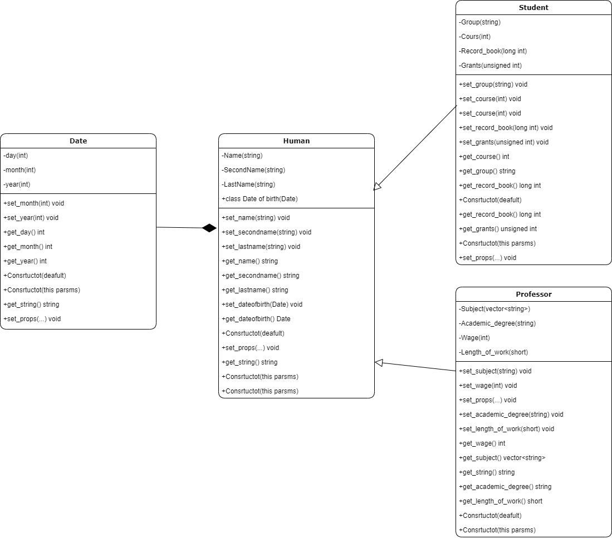
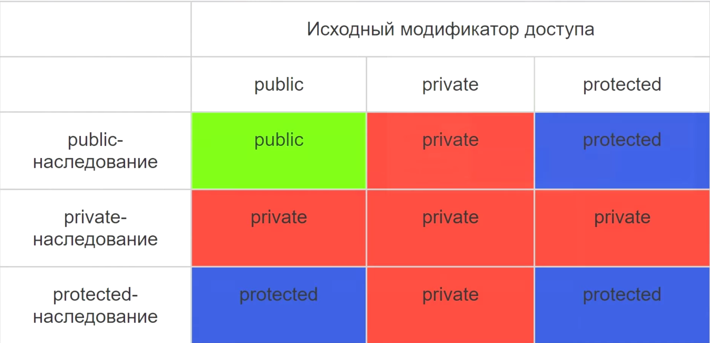

# Наследование

Райков ИВТ-20

## Класс Человек

### Поля

* Имя
* Фамилия
* Отчество
* Дата рождения

### Методы

* Сеттеры, геттеры
* Конструктор по умолчанию
* Конструктор с параметрами
* Вывод всей информации в виде строки

## Класс Студент

### Поля

* Курс
* Группа
* Зачетная книжка
* Стипендия

### Методы

* Сеттеры, геттеры
* Конструктор по умолчанию
* Конструктор с параметрами
* Вывод всей информации в виде строки

## Класс Профессор

### Поля

* Учебный предмет
* Зарплата
* Академ. степень
* Стаж работы

### Методы

* Сеттеры, геттеры
* Конструктор по умолчанию
* Конструктор с параметрами
* Вывод всей информации в виде строки

## Класс Дата

### Поля

* День
* Месяц
* Год

### Методы

* Сеттеры, геттеры
* Конструктор по умолчанию
* Конструктор с параметрами
* Вывод всей информации в виде строки

## UML Diagram

## Модификаторы доступа при наследовании
 

 
 

### Ассоциация, Агрегация и Композиция
* Ассоциация - человек и кошка. В коде, как поле другого класса, через указатели.
* Агрегация - человек и рука. В коде, как поле другого класса, через указатели.
* Композиция - человек и дата рождения. В коде, как поле другого класса, без указателей.